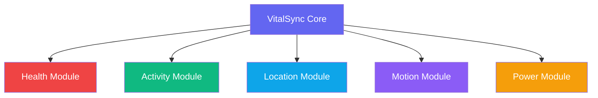

# VitalSync 🔄
> *Your Life, Synchronized*

<div align="center">


[](https://wearos.google.com/)
[](https://flutter.dev/)
[](LICENSE)
[](https://github.com/jaykerkar0405/VitalSync/releases)

</div>

## 🌟 Overview

**VitalSync** transforms your smartwatch into an intelligent health companion. Built with modular architecture, it seamlessly collects and analyzes health data to optimize your wellness journey.

<div>
<strong>🏃‍♂️ Track → 📊 Analyze → 🎯 Optimize → 🏆 Achieve</strong>
</div>

## ✨ Key Features

### 💗 Health Monitoring
- Real-time heart rate & stress tracking
- Health anomaly detection with smart alerts
- Personalized wellness insights
- Sleep quality & recovery analytics

### 🏃‍♂️ Activity Intelligence
- Automatic activity recognition
- Step challenges & goal coaching
- Workout zones optimization
- Smart movement reminders

### 🌍 Location & Safety
- Intelligent route tracking
- Emergency SOS & location sharing
- Geofenced notifications
- Safety zone alerts

### 🔋 Power Management
- AI-powered battery optimization
- Usage analytics dashboard
- Eco modes for extended life
- Smart charging patterns

## 🏗️ Architecture

<div align="center">



</div>

**Modular Benefits:**
- 🔧 **Plug & Play** - Enable/disable features as needed
- ⚡ **Performance** - Optimized resource allocation
- 🔄 **Scalable** - Easy feature integration
- 🏆 **Competition Ready** - Perfect for hackathons

## 🚀 Quick Start

### 🧰 Prerequisites

[](https://docs.flutter.dev/release/whats-new)
[](https://dart.dev/tools/sdk/archive)
[](https://developer.android.com/wear)

### Installation

```bash
# Clone the repository
git clone https://github.com/jaykerkar0405/VitalSync.git

# Navigate to project
cd VitalSync

# Install dependencies
flutter pub get

# Run on Wear OS device
flutter run
```

## 🎯 Use Cases

| 🏥 Healthcare | 🏃‍♂️ Fitness | 👴 Elder Care | 🏢 Corporate |
|---------------|---------------|---------------|---------------|
| Patient monitoring | Performance tracking | Safety monitoring | Wellness programs |
| Medical research | Training optimization | Health alerts | Team challenges |
| Rehabilitation | Goal achievement | Emergency response | Productivity metrics |

## 🛠️ Tech Stack

<div>
  
  <a href="https://flutter.dev/">
    
  </a>
  <a href="https://dart.dev/">
    
  </a>
  <a href="https://wearos.google.com/">
    
  </a>
  
</div>

## 🤝 Contributing

We welcome contributions! Here's how:

[](https://github.com/jaykerkar0405/VitalSync/issues)
[](https://github.com/jaykerkar0405/VitalSync/pulls)
[](https://github.com/jaykerkar0405/VitalSync/network/members)
[](https://github.com/jaykerkar0405/VitalSync/stargazers)

1. Fork the repository
2. Create feature branch (`git checkout -b feature/amazing-feature`)
3. Commit changes (`git commit -m 'Add amazing feature'`)
4. Push to branch (`git push origin feature/amazing-feature`)
5. Open Pull Request

## 📄 License

<div>

[](https://opensource.org/licenses/MIT)

**VitalSync** is open source software licensed under the MIT license.

</div>

---

<div align="center">

**Built with ❤️ for meaningful health technology solutions**

⭐ **Star this repo if you find it helpful!** ⭐

</div>
